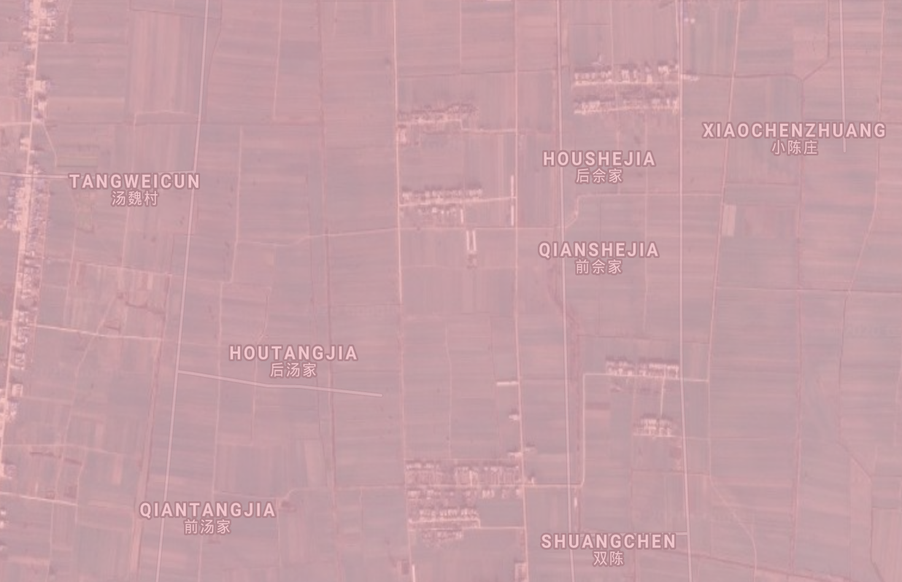

# Detecting Worldwide Extent of Cropland Irrigation

### A MIDS Capstone Project, UC Berkeley School of Information

_Brian Neesby, Deepak Nagaraj, Eleanor Proust, Yeonjoo Jung_

### Abstract

Detecting the extent of irrigation in croplands is important for food security and water management.  Food and Agriculture Organization (FAO) maintains a dataset of cropland areas worldwide equipped for irrigation.  This dataset is derived from government and census records.  With the advent of satellite data and large-scale machine learning, we can validate and improve upon this knowledge.  In this project, we first build a machine learning model that can classify irrigated croplands.  We use the FAO dataset developed by Siebert et al. as labels to train our model; our features include satellite data, climate data and soil data.  We then classify land on all continents except Antarctica for every 3 years from 2000 to 2018, at a spatial resolution of 8 km.  To run such large-scale predictions, we use the machine learning and data catalog service provided by Google Earth Engine (GEE).  We have made our maps available for interactive exploration as GEE applications on a Web site dedicated to the project.  Our model has accuracy of 84% and a kappa value of 0.46.  Our model map shows many false positives; however, in many cases they are indeed croplands, which means government data is underreporting the true extent of irrigated croplands.  This is particularly true of China and India.

### Acknowledgements

The project team sincerely wishes to thank [Prof. Paolo D'odorico](https://ourenvironment.berkeley.edu/people/paolo-dodorico), and [Lorenzo Rosa](https://ourenvironment.berkeley.edu/people/lorenzo-rosa), both from the Department of Environmental Science, University of California at Berkeley, for their guidance in the project.  We also thank [Alberto Todeschini](https://www.ischool.berkeley.edu/people/alberto-todeschini) and [Stanislav Kelman](https://www.ischool.berkeley.edu/people/stanislav-kelman) from the School of Information, UC Berkeley, for the project idea and meaningful suggestions throughout our work.

### Introduction

A major challenge in the 21st century is to feed a growing world population while in the middle of a warming climate trend.  Global agricultural production has to [double between 2005 and 2050](https://www.pnas.org/content/108/50/20260) to meet our needs then.  Agriculture is the [largest consumer of freshwater](http://www.fao.org/3/a-i7959e.pdf) globally at 70%, because food production is very water-intensive.  It is estimated that we need [1 to 3 tons of water to grow 1 kilogram of cereal; beef needs 5 times more](http://www.fao.org/3/a-i7959e.pdf).  Yet our use of water is inefficient and unsustainable.  Underground [aquifers have depleted](https://www.earth-syst-dynam.net/5/15/2014/esd-5-15-2014.pdf) due to overuse, [increased snowmelt](https://pubs.giss.nasa.gov/abs/ma07110n.html) and [drought due to climate change](https://royalsocietypublishing.org/doi/full/10.1098/rstb.2010.0152) has reduced water flows, and a lot of available water is wasted in [inefficient techniques](https://agupubs.onlinelibrary.wiley.com/doi/full/10.1029/2007WR006200) such as sprinkler and flood irrigation.

We should therefore manage our limited freshwater well so that we can continue to grow enough food to meet global demand.  Yet there is considerable uncertainty about the extent of irrigated croplands globally.  Many existing datasets rely on government records, which can be patchy or ignore sources of information: for example, minor or informal irrigated areas, or intensity of irrigation.  This uncertainty in available data means we cannot make good policy decisions on water usage or food-production planning, which can contribute to hunger and starvation especially in developing countries.

With the advent of high-resolution satellite data and large-scale machine learning, we can overcome some of the limitations of existing records.  Indeed, our model uses only climate, soil and satellite data to provide an estimate of irrigated croplands globally.  It requires no expensive censuses or cooperation across government entities, and can be run on any year that has the relevant data.

### Our Product

In this project, we have developed the following products.

* Global [maps of irrigated croplands](https://code.earthengine.google.com/?asset=users/deepakna/w210_results) at 8km resolution, for the years 2000, 2003, ..., 2018, as predicted by our machine learning model

* A [model assessment app](https://deepakna.users.earthengine.app/view/global-irrigated-croplands) for the year 2000

* A [sliding-pane comparison app](https://deepakna.users.earthengine.app/view/comparing-irrigated-cropland-areas) for any 2 years of prediction

* A time-series chart that shows changes and trend in irrigation over the predicted period of 2000-18

* An app that shows direction and [extent of change](https://deepakna.users.earthengine.app/view/global-irrigated-cropland-change) in irrigation between 2000 and 2018

* A [website](http://www.globalirrigationmap.org/) dedicated to the project and its results

* For available global label datasets, [maps](http://www.globalirrigationmap.org/view_MIRCA.html) and [comparison](http://www.globalirrigationmap.org/compare_labels.html)

### Prior Research

We now mention other research that has aimed to build a database of irrigated croplands at global scale.  Portmann et al. developed a global database of irrigated croplands, [MIRCA2000](https://agupubs.onlinelibrary.wiley.com/doi/full/10.1029/2008GB003435), based on government data at 5 arc minute (9.3km at equator) resolution.  Siebert et al. have a [time-series data](https://www.hydrol-earth-syst-sci.net/19/1521/2015/hess-19-1521-2015.html) of irrigated croplands from 1900 to 2005.  Thenkabail et al. primarily use spectral methods on satellite data to produce a global cropland dataset at 1 km resolution, [GIAM](https://waterdata.iwmi.org/Applications/GIAM2000/), which they have enhanced recently to be at 30m resolution, as [GFSAD30](https://www.usgs.gov/centers/wgsc/science/global-food-security-support-analysis-data-30-m-gfsad?qt-science_center_objects=0#qt-science_center_objects).  Salmon et al. follow a similar approach as ours to produce a global cropland dataset at 500m resolution, [GRIPC](http://www.gibbs-lab.com/wp-content/uploads/2015/09/Salmon_Global_rain_fed_irrigated_and_paddy_croplands_2015.pdf).  Meier et al. validate Siebert dataset and extend it with ancillary data, [producing a map](https://www.hydrol-earth-syst-sci.net/22/1119/2018/hess-22-1119-2018.pdf) at 30 arc seconds (1km at equator).

### Data Exploration

In order to detect irrigated croplands, we explored the following datasets for features.  Satellite NDVI data can be used to detect vegetation; climatic features such as rainfall and pressure, as well as soil moisture data can hint at irrigation.

#### Feature Datasets
| Dataset | Spatial resolution | Time resolution | Dataset availability | Features |
|---------|--------------------|-----------------|----------------------|--------------|
| [TERRACLIMATE](https://developers.google.com/earth-engine/datasets/catalog/IDAHO_EPSCOR_TERRACLIMATE) | 2.5 arc min = 4.6 km equator = 1.8 km polar circle | Monthly | 1958-present | Climate: precipitation, temperature, pressure |
| MODIS Satellite [MOD13A2](https://developers.google.com/earth-engine/datasets/catalog/MODIS_006_MOD13A2), [MOD09GA](https://developers.google.com/earth-engine/datasets/catalog/MODIS_006_MOD09GA) | 1 km | 16-day average | 2000-present | Vegetation, water indices |
| [NASA GLDAS](https://developers.google.com/earth-engine/datasets/catalog/NASA_GLDAS_V021_NOAH_G025_T3H) | 0.25 arc deg = 27.8 km equator = 10 km polar circle | 3-hourly | 2000-present | Soil moisture, evaporation |
| [NASA GRACE](https://developers.google.com/earth-engine/datasets/catalog/NASA_GRACE_MASS_GRIDS_LAND) | 1 arc deg = 111 km equator = 45 km polar circle | Monthly | 2002-2017 | Groundwater |

#### Label Dataset
| Dataset | Spatial resolution | Time resolution | Dataset availability | Details |
|---------|--------------------|-----------------|-------------|----------|
| [MIRCA2000](https://code.earthengine.google.com/?asset=users/deepakna/mc4MaxIrrigatedHa) | 5 arc min = 9.3 km equator = 3.6 km polar circle |  Annual | 2000 | Labels: Maximum area equipped for irrigation, Hectares |

All the feature datasets are available on Google Earth Engine.  We originally included all features in the datasets, before selecting the most important ones in our final model.  Because our label is a single value for the entire year, we took the maximum value over a year for satellite data, and the mean value for all other features.

The labels are numerical values representing maximum area equipped for irrigation, in hectares.  This showed a highly skewed distribution.  We did a logarithmic transformation and converted the transformed labels into a binary category: we treated all values above 1 as "irrigated", and not irrigated otherwise.

We also explored another label dataset: [GFSAD1000](https://developers.google.com/earth-engine/datasets/catalog/USGS_GFSAD1000_V0).  This was developed for 2010 and is at 1km resolution.  But in the end, we decided to use MIRCA2000 for our project as a source of comparison between pure government data versus data from climate, satellite and soil.

### Scale and Scope

Our project aims to provide a global map of irrigated cropland.  Specifically, our model maps cover the following land masses:

* North America
* Central America and the Caribbean Islands
* South America
* Europe
* Africa
* North, Central and East Asia
* South-west, South and South-east Asia
* Australia
* New Zealand and Papua New Guinea from Oceania

Our maps are at a resolution of 8km, and are available separately for the years 2000, 2003, 2006, 2009, 2012, 2015 and 2018.

We fit a single model on a global sample of data, i.e. we do not have separate models for regions or continents.  We do not use any land-cover masks, such as for deserts or forests.  Our model uses 9 features, selected from an original set of 53 features.

Before the prediction could run, the features needed to be processed separately and collected as input.  At 8km and 3-hourly resolution, a GLDAS feature for a year is about 8800 million data points to be averaged, and we have 4 such features in our model.  MODIS satellite data is 72 million data points, and TERRACLIMATE data is 4 features with 36 million data points each.  Thus a total of about 35,000 million numeric data points, or about 140 GB of data, are processed to obtain features for a given year.  Altogether we processed about 990 GB of data to generate all the feature maps from 2000 through 2018.  We saved the features as multi-band GeoTIFF images.

Once the features are available, a single prediction run for a year classifies 3.0 million rows that span the continents.  Each row contains 9 columns that correspond to our features, and latitude and longitude.  Assuming all of them are numerics at 4 bytes each, the total data size is about 130 MB per year.  For each row in this table, the model builds a random forest of 1000 trees.  A run on a single year takes 4 hours to finish on [Google Earth Engine](https://earthengine.google.com/), a service that uses data- and model-parallelism to provide large-scale machine learning.

Model resolution is a key engineering decision in this project.  Going from 8km to 1km resolution increases the data 64 times.  This is because we are dealing with geographic areas.  In computing terminology, this is an [O(N2)](https://en.wikipedia.org/wiki/Time_complexity#Polynomial_time) problem.  However, because each prediction is independent of the others, the data lend themselves to a form of parallelization called [map-reduce](https://en.wikipedia.org/wiki/MapReduce):  Google Earth Engine lets us partition the data into run computations on these smaller chunks ("map"), and then coalesce the results ("reduce").  Programming to a map-reduce paradigm is harder and requires considerable forethought.  GEE also links complex data transformations together and starts the chain only when called to be output; this is known as [lazy evaluation](https://en.wikipedia.org/wiki/Lazy_evaluation) and is seen in other big-data technologies as well, such as Apache Spark.

### Model Development

We fit our model on a random sample of 5,000 points from all over the world.  For the feature datasets we introduced earlier, we obtained all features for these sample points, as well as labels.  We then downloaded this sample feature dataset for model development.  About 15% of the sample was irrigated cropland.

We used R, specifically the [caret](http://topepo.github.io/caret/index.html) package, for model development.  Our choice of models was limited to what we could ultimately run on Google Earth Engine.  We tried [logistic regression](https://en.wikipedia.org/wiki/Logistic_regression), [SVM with radial kernel](https://en.wikipedia.org/wiki/Radial_basis_function_kernel), and [random forest](https://en.wikipedia.org/wiki/Random_forest).  We evaluated them for area under ROC curve ([AUC](https://en.wikipedia.org/wiki/Receiver_operating_characteristic)); random forest was the winner.

Random forest also gave us insight into the most important features.  We added the most important features one by one until we obtained a model that was within one standard error of our evaluation metric.

| Dataset | Feature | Remark |
|---------|---------|--------|
| GLDAS | [Transpiration](https://en.wikipedia.org/wiki/Transpiration) | Evaporation from leaves |
| N/A | [Latitude](https://en.wikipedia.org/wiki/Latitude) | A proxy for latitude-specific features, such as amount of sunlight and prevailing winds |
| TERRACLIMATE | Minimum temperature ||
| TERRACLIMATE | [Vapor pressure deficit](https://en.wikipedia.org/wiki/Vapour-pressure_deficit) | High deficit indicates lower chance of rain |
| TERRACLIMATE | [Vapor pressure](https://en.wikipedia.org/wiki/Vapor_pressure) | A measure of how much moisture exists in the air |
| GLDAS | Root zone soil moisture ||
| N/A | [Longitude](https://en.wikipedia.org/wiki/Longitude) | A proxy for longitude-specific features, such as north-south coast lines, mountain chains or ocean currents |
| GLDAS | [Albedo](https://en.wikipedia.org/wiki/Albedo) | Fraction of sunlight reflected back to space: water reflects less than land |
| MODIS | [NDVI](https://en.wikipedia.org/wiki/Normalized_difference_vegetation_index) | A number derived from light reflected in near infra-red and red spectrum, as seen by satellite and indicative of vegetation |
| GLDAS | Bare soil evaporation ||
| TERRACLIMATE | Wind speed | Wind can hasten evaporation, or bring clouds |

We split our training sample 90:10 for training and test set.  We used [5-fold cross-validation](https://en.wikipedia.org/wiki/Cross-validation_(statistics)#k-fold_cross-validation) on training set during model development.  We ran the final model on the held out test set.  On this set the model showed accuracy of 0.90 and kappa score of 0.50.

Once we finalized our model in R, we invoked the same model on Google Earth Engine with the same hyperparameters.  With a tuning length of 10 on caret package, our tuned hyperparameters were:

* number of trees: 1000
* variables per split: 7
* bagging fraction: 0.63
* probability threshold: 0.15

### Model Assessment

When we classified all the 2000 data with the model, we obtained the [confusion matrix](https://en.wikipedia.org/wiki/Confusion_matrix) below.

|&darr; Classified Actual &rarr; | Actual Irrigated | Actual Not-irrigated | TOTAL |
|--------------------------------|--------------|---------------|-------|
| Predicted Irrigated | 266606 | 408550 | 675156 |
| Predicted Not-irrigated | 46199 | 2194922 | 2241121 |
| TOTAL | 312805 | 2603472 | 2916277 |

Additional evaluation metrics:

* [Kappa](https://en.wikipedia.org/wiki/Cohen%27s_kappa): 0.46
* [Precision](https://en.wikipedia.org/wiki/Precision_and_recall): 0.40
* [Recall](https://en.wikipedia.org/wiki/Precision_and_recall): 0.85
* [Accuracy](https://en.wikipedia.org/wiki/Accuracy_and_precision): 0.84

From the confusion matrix, we can see that the model shows a large number of false positives.  We explored some of them on a satellite map and they do show cropland areas.  We believe that the labels obtained from government data understates true extent of irrigated croplands.

As example, we show below a region in Russia, south-east of Moscow, which is not marked as irrigated in the labels, but clearly shows croplands in satellite imagery.  We colored false-positives pink, so it has a reddish tinge.

The model also detects pivot irrigation in deserts, such as the circles we see below in Arabia.  Notice the green tinge color we've used that indicates "true positive".

Two more examples follow where the model predicts cropland and the label does not, but satellite clearly shows croplands, validating the model:

Bihar, East India:

Near Suzhou, East China:

### Results

For the year 2000 data, the model predicts that 23% of the land is irrigated.  This is almost double what is stated in the (binary) labels: 11%.  A lot of it is a weakness in the model itself, but as we show earlier, there is underreporting in government records as well.  An earlier model by Thenkabail et al. that used satellite data also showed 40% more irrigated croplands than stated in the records, corroborating our work to some extent.

A second use case for the model was to see patterns over time.  From the model predictions over the years between 2000 and 2018, we can also see trends in irrigation.  We see a clear trend line of increase.  Between the years 2000 and 2018, the number of 8km x 8km squares marked irrigated went up by 12% worldwide.  Only one year, 2009, shows a marked drop in irrigation, which could perhaps be due to an economic recession around that time.  It quickly rebounds, however.

### Limitations and Future Plans

There are a few limitations in the model worth mentioning here.  Forecasting many years into the future with a single training period is risky, when the features themselves have trends: for example, minimum temperature, a feature in our model, has an increasing trend in our current period of global warming.  8km resolution is probably too coarse for smaller croplands.  We may be able to model better with measures of dispersion in our features rather than measures of centrality: overall, there is a lot of scope to do better in feature engineering.  A sample of 5,000 points may not be enough to obtain all the variance in data when the class imbalance is high; it is worth modelling on a larger sample, or exploring methods to synthesize data such as [SMOTE](https://en.wikipedia.org/wiki/Oversampling_and_undersampling_in_data_analysis#SMOTE).

Resolution continues to be an engineering challenge.  Every increase in resolution will need experimentation in the new task size so that Google Earth Engine can cope with the quadratic increase in data.  It is probably prudent to increase it in steps, instead of going all the way high.

